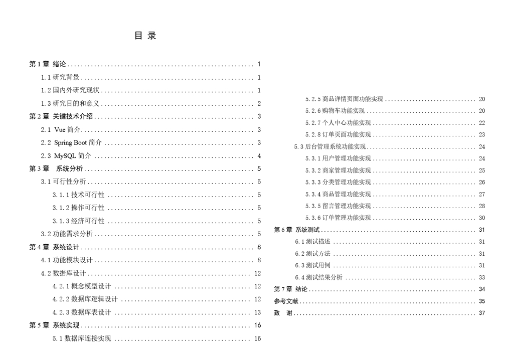

 **郑重声明：项目经过本地测试，确保可以运行， 可以用于学习和毕业设计参考~** 

**[点我获取源码](https://x-x.fun/e/MY93833ea0Pnw)💕🤞**

[点我查看更多](http://blog.cyrobot.top/blog)💕🤞

#### 1.项目介绍
    主要针对校园环境下的打印服务，从消费者和商家两个角度出发，对打印现存的问题提出了解决方案，主要实现的功能包括：用户的登录和注册、查看打印店及打印商品、加入购物车、提交订单、模拟支付、留言、生成取件码。

- 技术选型+环境： SpringBoot + Vue + Vant组件库 + MySQL + IDEA2022
- 后端功能：用户管理、商家管理、分类管理、商品管理、留言管理、订单管理
- 前端功能：登录、分类、购物车、下单、留言、个人中心等
- 角色： 管理员、商家、普通用户

**内附较为规范的毕业设计文档，本项目仅用于学习和毕业设计参考~**

#### 2.本地部署
##### 2.1 后端部署
- 创建数据库，导入项目中的sql文件
- 打开IDEA，导入项目backend，根据本地环境，修改src/main/resources/application.yml下的数据库连接
- 启动项目（右上角运行，或者打开src/main/java/com/shop/demo/DemoApplication.java运行项目）

##### 2.2 前端部署
- 打开前端开发IDE（vsCode、Webstorm），如果使用IDEA，需要安装Vue插件
- 执行 npm install
- 执行 yarn run dev 启动项目
- 管理web：http://localhost:9528/#/login  管理员账号/密码：admin/admin
- 移动端：http://localhost:9528 用户账号/密码：zhaomin/123456  （浏览器F12，手机模式查看）

#### 3. 项目部分截图
